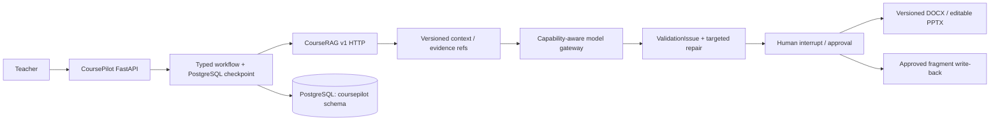

# CoursePilot architecture

## Ownership boundary

- CoursePilot owns tasks, checkpoints, artifacts, approvals, model invocations and exports.
- CourseRAG owns parsing, Evidence, KP, indexes, contexts and verified-content overlays.
- The default public runtime uses Remote HTTP. No CourseRAG ORM, parser or index implementation is
  imported by the new workflow runtime.
- The old in-process `coursepilot.rag` path is retained only for compatibility and B0 comparison.
  It is deprecated and disabled unless `COURSEPILOT_LEGACY_RAG_ENABLED=true` is explicitly set.

The local portfolio deployment shares one PostgreSQL instance but uses independent `coursepilot`
and `courserag` schemas and Alembic histories.
