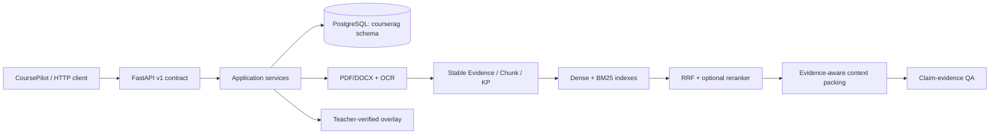

# CourseRAG architecture

## Boundary

PostgreSQL is the business fact source. Vector indexes and caches are rebuildable. CoursePilot
does not import these implementations; it communicates through the versioned HTTP contract.

## Local portfolio mode

`COURSERAG_RUNTIME_MODE=demo` uses labelled deterministic evidence so the public demo can run
without redistributing textbooks, model weights, private evaluation data, or paid credentials.
It demonstrates the contract and trace path, not retrieval quality.
